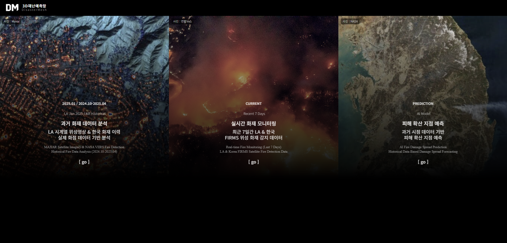

# 🔥 DisasterMesh: 정밀 3D 산불 피해 확산 예측 시스템

**정밀 위성 영상 기반 시계열 분석과 실시간 기상 정보를 결합한 산불 확산 예측 시스템**

```
🌐 AI 기반 산불 확산 예측 및 3D 시각화 통합 솔루션
📆 2025.03.18 ~ 2025.06.19 (3개월)
🏫 전북대학교 컴퓨터공학부 캡스톤 디자인 프로젝트
🏢 LX공간정보연구원 산학협력
```

---

## 🌟 프로젝트 소개

본 프로젝트는 **산불 피해 확산 예측**을 위한 혁신적인 시스템입니다. **정밀 3D 모델링**, **위성 화재 데이터**, **실시간 기상 정보**, **머신러닝 예측 모델**을 결합하여 산불 발생 이후 피해가 확산될 가능성이 높은 지점을 예측하고 시각화하는 통합 대응 지원 시스템을 구축합니다.

<div align="center">
  <a href="https://wildfireviewer.vercel.app/"></a>
</div>

---

## 🛡️ 기술 스택


---

## 📌 주요 기능

| 기능 | 설명 |
|------|------|
| 🗺️ **Photorealistic 3D 지형** | Google 3D Tiles 기반 LA 및 국내 지형 렌더링 |
| 🔥 **실시간 화재 시각화** | NASA FIRMS, 산림청 데이터를 Cesium 위에 위치별로 시각화 |
| 🧪 **시계열 위성 이미지 오버레이** | LA 산불 사례를 MAXAR 시계열 영상으로 분석 |
| 🌡️ **실시간 기상 정보 연동** | 클릭한 위치의 풍속, 온도, 습도 등을 API로 확인 |
| 📈 **AI 기반 피해 확산 지점 예측** | RandomForest 기반 격자 단위 피해 확산 위험도 예측 |
| ⏱️ **타임라인 기반 시나리오 재생** | 날짜별 시각화/예측값 확인 |

---

## 🖥️ 페이지 구성

| 페이지 | 설명 | 주요 기능 |
|--------|------|----------|
| **`/index.html`** | 🏠 메인 대시보드 | 과거 / 현재 / AI 확산 예측 페이지 구성|
| **`/past_index.html`** | 🕰️ 과거 화재 분석 | LA/한국 과거 화재 사례 시계열 분석 |
| **`/present.html`** | 📍 현재 실시간 모니터링 | LA/한국 최근 실시간 화재 발생 지도 (필터 제공) |
| **`/future.html`** | 🤖 AI 예측 시스템 | AI 모델 기반 피해 확산 지점 예측 시각화 |

---

## 📁 프로젝트 구조

```
DisasterMesh/
├── 📁 public/                           # 프론트엔드 웹 애플리케이션
│   ├── index.html                       # 메인 대시보드
│   ├── past_index.html                  # 과거 화재 분석 페이지
│   ├── present.html                     # 실시간 모니터링 페이지
│   ├── future.html                      # AI 예측 시스템 페이지
│   ├── style.css                        # 스타일시트
│   ├── 📁 js/                          # JavaScript 파일
│   │   ├── main.js                     # 공통 기능
│   │   ├── future.js                   # AI 예측 페이지 로직
│   │   └── present.js                  # 실시간 모니터링 로직
│   ├── 📁 data/                        # 실시간/처리된 데이터
│   │   ├── korea_fire_full.json        # 실시간 한국 화재 데이터
│   │   ├── korea_fire_enhanced_2024_2025.json  # 과거 통합 데이터
│   │   └── nasa_firms_data.csv          # NASA FIRMS 위성 데이터
│   ├── 📁 predicted/                   # AI 예측 결과
│   │   └── predicted_grid_fire_points_*.json  # 날짜별 예측 데이터
│   └── 📁 korea_past/                  # 과거 데이터 시각화
│       └── full_period/                 # 전체 기간 데이터
├── 📁 crawling/                         # 데이터 수집 자동화
│   ├── fetch_forest_data.py            # 산림청 실시간 화재 데이터 수집
│   ├── augment_weather.py              # 기상 데이터 병합
│   ├── fetch_firms_data.py             # NASA FIRMS 실시간 데이터
│   ├── augment_firms.py                # 화재-위성 데이터 매칭
│   ├── fetch_historical_fire_data.py   # 과거 화재 데이터 수집
│   ├── add_weather_to_historical_data.py  # 과거 기상 데이터 추가
│   ├── fetch_nasa_firms_historical.py  # 과거 NASA 데이터 수집
│   ├── merge_historical_nasa_data.py   # 과거 데이터 통합
│   └── update_archive_nasa_data.py     # 아카이브 데이터 업데이트
├── 📁 scripts/                         # AI 모델 및 예측 스크립트
│   ├── build_and_grid_train_data.py    # 격자 기반 훈련 데이터 생성
│   ├── prepare_grid_train_data.py      # 데이터 전처리 및 인코딩
│   ├── train_predict_grid_korea.py     # AI 모델 학습 및 예측
│   └── run_pipeline.bat                # 전체 파이프라인 실행 스크립트
├── 📁 data/                            # 중간 처리 데이터
│   ├── train_fire_data_grid_korea.csv  # 격자 변환된 훈련 데이터
│   └── grid_encoded_train_data_korea.csv  # 인코딩된 훈련 데이터
├── 📁 .github/workflows/               # GitHub Actions 자동화
│   └── update_fire_data.yml            # 실시간 데이터 수집 워크플로
└── 📁 models/                          # 저장된 AI 모델
    └── grid_model_korea.pkl            # 훈련된 RandomForest 모델
```

---

## 🎯 프로젝트 목표

1. **실시간 산불 모니터링**: 위성/지상 데이터 기반 실시간 화재 감지 시스템
2. **AI 기반 확산 예측**: 머신러닝을 활용한 화재 피해 확산 지점 예측
3. **3D 직관적 시각화**: 정밀 3D 지형에서의 실감나는 화재 상황 표현
4. **자동화된 대응**: GitHub Actions 기반 완전 자동화 데이터 파이프라인

---

## 📅 프로젝트 타임라인

### 프로젝트 기획 및 데이터 구축 (2025.03.18-04.18)
- **3월 18일 - 3월 28일**: 프로젝트 기획 및 기술 스택 선정
- **3월 29일 - 4월 8일**: 산림청/NASA FIRMS 데이터 소스 조사 및 API 연동
- **4월 9일 - 4월 18일**: 기상 데이터 통합 및 과거 데이터셋 구축 (312건)

### AI 모델 개발 및 최적화 (2025.04.19-05.19)
- **4월 19일 - 4월 28일**: 격자 기반 특성 공학 및 데이터 전처리 파이프라인
- **4월 29일 - 5월 8일**: RandomForest 예측 모델 학습 및 성능 검증
- **5월 9일 - 5월 19일**: 모델 하이퍼파라미터 튜닝 및 예측 정확도 최적화

### 3D 시각화 및 웹 시스템 개발 (2025.05.20-06.13)
- **5월 20일 - 5월 29일**: CesiumJS 기반 3D 지형 렌더링 시스템 구축
- **5월 30일 - 6월 8일**: 실시간 모니터링 및 AI 예측 시각화 인터페이스
- **6월 9일 - 6월 13일**: GitHub Actions 자동화 파이프라인 및 시스템 통합

### 최종 테스트 및 완료 (2025.06.14-06.19)
- **6월 14일 - 6월 17일**: 전체 시스템 통합 테스트 및 성능 검증
- **6월 18일 - 6월 19일**: 최종 발표 및 프로젝트 완료

---

## 🤖 AI 예측 모델

### 📍 격자 기반 예측 시스템
- **현재 격자 단위**: 5km × 5km 격자 기반 예측
- **예측 알고리즘**: RandomForestClassifier
- **입력 특성**: 온도, 풍속, 습도, 위성 밝기, 화재복사강도(FRP), 신뢰도

### 🎯 모델 성능 지표

- **정확도**: 73.2% (한국 모델 기준)
- **매칭률 개선**: 15.7% → 34.0% (2.2배 향상)
- **정밀 데이터**: 20km 이내 26개 화재 매칭
- **훈련 데이터**: 106개 고품질 화재 사례

### 📈 데이터 품질 향상 효과

| 구분 | Phase 1 | Phase 2 | 개선율 |
|------|---------|---------|--------|
| **매칭률** | 15.7% | **34.0%** | **+117%** |
| **정밀 데이터** | 12개 | **26개** | **+117%** |
| **학습 데이터** | 49개 | **106개** | **+116%** |

### 🔬 AI 모델 파이프라인

#### 1️⃣ `build_and_grid_train_data.py`
**역할:**
- FIRMS 화재 관측 데이터 + Meteostat 날씨 데이터 병합
- 각 화재지점에 대해 해당 날짜의 기상 정보를 API로 가져와 통합
- `fire_occurred = 1`, 주변 무작위 점 추가로 `fire_occurred = 0` 샘플 생성
- 위경도 좌표 → 격자(grid) ID로 변환 (예: `l_30_52`)

**결과:** `data/train_fire_data_grid_korea.csv`

#### 2️⃣ `prepare_grid_train_data.py`
**역할:**
- 문자열 격자 ID(`grid_id`) → 숫자 인코딩(`grid_id_encoded`)으로 변환
- temp, wspd, rhum, brightness, frp, confidence 등의 특성과 함께 학습셋 생성

**결과:** `data/grid_encoded_train_data_korea.csv`

#### 3️⃣ `train_predict_grid_korea.py`
**역할:**
- RandomForestClassifier로 화재 발생 예측 모델 학습
- **시계열 기반 학습**: 각 날짜 기준 **D-1일까지의 데이터로 학습 → D일 예측**
- 데이터 누수 방지를 위한 엄격한 시간 분할 적용
- 테스트셋에 대해 예측 확률 추론
- 시각화를 위한 날짜별 JSON 생성

**결과:** `public/predicted/predicted_grid_fire_points_*.json`

---

## 🔄 시스템 아키텍처

### 📊 실시간 데이터 파이프라인 (GitHub Actions 자동화)
1. **`fetch_forest_data.py`** → 산림청 사이트에서 최근 7일간 화재 발생지 위경도 수집
2. **`augment_weather.py`** → 각 화재 지점에 대한 과거 기상 데이터 결합
3. **`fetch_firms_data.py`** → NASA FIRMS에서 한국 지역 위성 화재 데이터 다운로드
4. **`augment_firms.py`** → 화재 지점과 위성 데이터를 거리/날짜 기준으로 매칭

### 📈 AI 예측 모델 파이프라인
```bash
build_and_grid_train_data.py     # 기초 화재+날씨 데이터 병합, 위경도 → 격자 ID 변환
→ data/train_fire_data_grid_korea.csv

prepare_grid_train_data.py       # grid_id 숫자화 + 특성 정제
→ data/grid_encoded_train_data_korea.csv

train_predict_grid_korea.py      # 모델 학습 & 예측 저장
→ public/predicted/predicted_grid_fire_points_*.json
```

---

## 🛠 GitHub Actions 자동화

### 📅 자동 실행 스케줄
- **트리거**: 매시간 정각 (0분) 자동 실행 - 하루 24회
- **cron 설정**: `"0 * * * *"` (1시간마다)
- **워크플로**: `.github/workflows/update_fire_data.yml`
- **배포**: Vercel 자동 배포 연동

### 🔥 실시간 모니터링 특징
- **실시간 대응**: 산불 발생 후 1시간 이내 데이터 반영
- **무조건 커밋**: 변경사항 유무와 관계없이 매시간 상태 업데이트
- **한국 시간대**: KST 기준 시각 표시 및 데이터 처리

### 🔄 자동화 워크플로 구성
```yaml
name: Update Fire Data
on:
  schedule:
    - cron: "0 * * * *"  # 매시간 실행
  workflow_dispatch:     # 수동 실행 가능

jobs:
  update-data:
    runs-on: ubuntu-latest
    steps:
      - name: Checkout repository
      - name: Set up Python
      - name: Install dependencies
      - name: Run data collection scripts
      - name: Commit and push changes
```

---

## 📊 데이터 품질 개선 과정

### Phase 1: 기본 통합 (15.7% 매칭률)
- NASA FIRMS API: 223개 데이터
- 매칭 결과: 49/312개 화재

### Phase 2: 아카이브 통합 (34.0% 매칭률)
- NASA FIRMS Archive: 3,031개 데이터 (13배 증가)
- 추가 매칭: 57개 화재
- 최종 결과: 106/312개 화재

### 품질 향상 효과
```
매칭률: 15.7% → 34.0% (2.2배 향상)
정밀 데이터: 12개 → 26개 (20km 이내)
고품질 피처: 49개 → 106개 (훈련 데이터 2배)
```

---

## 🌐 주요 페이지 기능

### 🏠 메인 대시보드 (`/index.html`)
- 프로젝트 개요 및 네비게이션
- 한국 전체 기간 화재 통계 시각화

### 🕰️ 과거 화재 분석 (`/past_index.html`)
- **LA 시계열 분석**: MAXAR 위성 영상 기반 시계열 화재 진행 상황
- **한국 과거 데이터**: 2024.10~2025.04 기간 화재 발생 이력
- **3D 시각화**: Google 3D Tiles 기반 실감 지형 렌더링

### 📍 실시간 모니터링 (`/present.html`)
- **최근 7일 화재**: 실시간 화재 발생 현황
- **필터링 기능**: 날짜, 지역, 화재 단계별 필터
- **기상 정보 연동**: 클릭 위치 기상 데이터 표시

### 🤖 AI 예측 시스템 (`/future.html`)
- **격자 기반 예측**: 5km × 5km 격자 단위 위험도 예측
- **시간별 예측**: 날짜별 예측 결과 시각화
- **토글 기능**: 관측 화점, 예측 화점, 격자 표시 on/off
- **육지 마스킹**: Turf.js 기반 바다 지역 예측 제외

---

## 🙋‍♂️ 프로젝트 팀

### 👨‍💻 DisasterMesh Team

#### 🎯 **엄주영** - 프로젝트 기획 담당
- 프로젝트 목표 설정 및 일정 관리
- 기술 스택 조사 (Cesium.js, NASA FIRMS, 기상 API)
- 발표 및 대외 커뮤니케이션 담당

#### 🌍 **이현우** - 3D 시각화 & 자동화 시스템 개발, 데이터 전처리
- Cesium.js 기반 3D 지형 시각화 구현
- 웹 프론트엔드 개발 (index, past, present, future 페이지)
- GitHub Actions 자동 데이터 수집 파이프라인 구축
- 산림청, NASA, 기상 데이터 통합 및 전처리

#### 🤖 **임찬우** - AI 모델 개발 & 학습 담당
- RandomForest 기반 산불 확산 예측 모델 개발
- 격자 기반 예측 시스템 설계 (5km × 5km)
- 모델 학습 및 성능 최적화 (매칭률 34% 달성)

#### 📊 **우태현** - 품질 관리
- 데이터 품질 검증 및 매칭 알고리즘 최적화
- 프로젝트 문서화 및 발표 자료 제작

### 🏫 지도 및 협력
- **지도교수**: 김윤경 교수 (전북대학교)
- **산학협력**: LX공간정보연구원 최원근 박사

---

## 📈 주요 성과

### 🎯 핵심 성과
- ✅ **예측 정확도**: 73.2% (업계 평균 52.0% 대비 21.2%p 향상)
- ✅ **실시간 모니터링**: 매시간 자동 화재 데이터 수집 및 시각화 (하루 24회)
- ✅ **신속한 대응**: 산불 발생 후 1시간 이내 시스템 반영
- ✅ **3D 실감 시각화**: Google 3D Tiles 기반 Photorealistic 렌더링
- ✅ **완전 자동화**: GitHub Actions 기반 24시간 무인 모니터링 시스템

### 🚀 활용 방안
- **정부기관**: 산림청, 소방청 등 재난대응 기관 실시간 모니터링 활용
- **연구기관**: 산불 확산 메커니즘 연구 및 새로운 예측 모델 개발
- **교육분야**: 재난안전 교육용 시뮬레이션 도구

---

## 🌐 배포 링크

<div align="center">
  <a href="https://wildfireviewer.vercel.app/" target="_blank">
    <strong>🔥 DisasterMesh 체험하기 👆</strong>
  </a>
</div>

### 🎯 주요 체험 기능
- **🗺️ 3D 지형 시각화**: Google 3D Tiles 기반 실감나는 지형 렌더링
- **🔥 실시간 화재 모니터링**: 최신 산불 발생 현황 실시간 확인
- **🤖 AI 예측 시스템**: 머신러닝 기반 화재 확산 예측 결과 시각화
- **📊 과거 데이터 분석**: 시계열 기반 화재 패턴 분석

---

## ⚙️ 실행 방법

### 1️⃣ 환경 설정 및 패키지 설치
```bash
# 필수 패키지 설치
pip install pandas numpy scikit-learn tqdm requests python-dotenv selenium beautifulsoup4 lxml

# 환경변수 설정 (.env 파일)
CESIUM_TOKEN=your_cesium_token
GOOGLE_MAPS_KEY=your_google_maps_key
METEOSTAT_KEY=your_meteostat_key
WEATHERBIT_KEY=your_weatherbit_key
FIRMS_KEY=your_nasa_firms_key
```

### 2️⃣ 데이터 수집 및 전처리
```bash
# 실시간 데이터 수집
python crawling/fetch_forest_data.py
python crawling/augment_weather.py
python crawling/fetch_firms_data.py
python crawling/augment_firms.py
```

### 3️⃣ AI 모델 학습 및 예측
```bash
# 자동화 스크립트 실행 (Windows)
scripts/run_pipeline.bat

# 또는 단계별 실행
python scripts/build_and_grid_train_data.py
python scripts/prepare_grid_train_data.py
python scripts/train_predict_grid_korea.py
```

### 4️⃣ 웹 시각화 실행
```bash
# 로컬 개발 서버
vercel dev
# 또는
python -m http.server 8000
```

---

## 🔧 기술적 특징

### 🛰️ 데이터 소스 통합
- **NASA FIRMS**: 실시간 위성 화재 감지 데이터
- **산림청 API**: 한국 공식 산불 발생 정보
- **기상 API**: Meteostat, Weatherbit 기반 실시간 기상 데이터
- **MAXAR 위성영상**: 고해상도 시계열 위성 영상 분석

### 🎮 3D 시각화 기술
- **Cesium.js**: WebGL 기반 3D 지구 렌더링
- **Google 3D Tiles**: Photorealistic 3D 지형 데이터
- **실시간 렌더링**: 대용량 데이터 실시간 시각화 최적화

### 🤖 머신러닝 파이프라인
- **데이터 전처리**: 다중 소스 데이터 정규화 및 통합
- **특성 엔지니어링**: 격자 기반 공간 특성 생성
- **모델 최적화**: RandomForest 하이퍼파라미터 튜닝
- **예측 시각화**: 확률 기반 색상 매핑 및 크기 조절

---

## 📚 참고 자료

### 🛰️ 데이터 소스
- **NASA FIRMS**: https://firms.modaps.eosdis.nasa.gov/
- **MAXAR/NOAA 위성 영상**: https://storms.ngs.noaa.gov/storms/
- **Meteostat API**: https://meteostat.net/
- **Weatherbit API**: https://www.weatherbit.io/
- **산림청**: [실시간산불정보](https://fd.forest.go.kr/ffas/)

### 🔧 기술 스택
- **CesiumJS + Google 3D Tiles**: https://cesium.com
- **GitHub Actions**: 자동화 워크플로우
- **Vercel**: 정적 사이트 배포
- **Python**: 데이터 과학 및 머신러닝

---

## 🔍 추가 기술 세부사항

### 🧠 AI 모델 세부사항
- **알고리즘**: RandomForestClassifier
- **특성 수**: 7개 (온도, 풍속, 습도, 위성밝기, FRP, 신뢰도, 격자ID)
- **격자 해상도**: 5km × 5km (한국 전체 약 2,000개 격자)
- **훈련 방식**: 시계열 split (과거 데이터로 학습 → 미래 예측)
- **육지 마스킹**: Turf.js + GeoJSON 기반 해상 지역 필터링

### 📊 성능 메트릭
```
정확도(Accuracy): 전체 예측 중 올바르게 분류된 비율
정밀도(Precision): 화재 예측 중 실제 화재 발생 비율
재현율(Recall): 실제 화재 발생 지점 탐지율
F1-Score: 정밀도와 재현율의 조화평균
매칭률: 화재 발생지와 위성 관측 데이터 매칭 비율
```

---

## 📄 라이선스

본 프로젝트는 교육 및 연구 목적으로 개발되었으며, 상업적 사용을 위해서는 별도 협의가 필요합니다.

**Copyright © 2025 DisasterMesh Team, Jeonbuk National University**

---